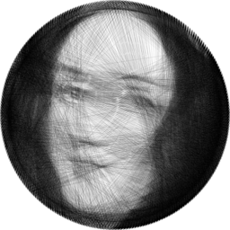
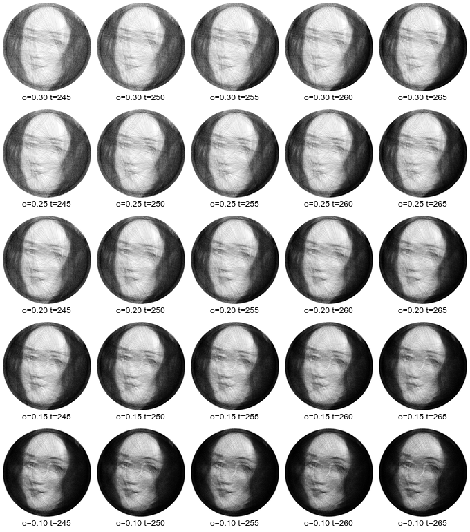
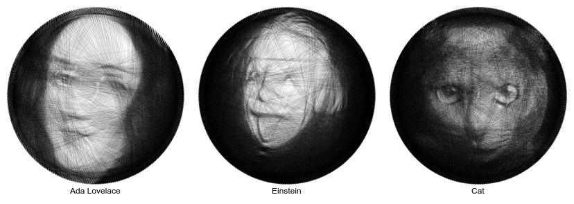

# string-art
A C++ implementation of an algorithm to generate photorealistic string art images. See my [blog post](https://gabrieleballetti.github.io/posts/2022-07-29-string-art/) for details and more examples.

 Algorithm animation |  Final result
:-------------------------:|:-------------------------:
 |  

## Usage

To compile simply run `make`.

The script can be run as

```
string_art input.pgm num_pins opacity threshold skipped_neighbors output.pgm
```

where
 - `input.pgm` is a square binary “P5” portable graymap image without comments (suggested `512x512`),
 - `num_pins` is the number of nails (suggested: `256`),
 - `opacity` is the opacity factor, see below (suggested: `0.2`, higher value means brighter image),
 - `threshold` is the opacity factor, see below (suggested: `255`, higher value means brighter image),
 - `skipped_neighbors` is how consecutive nails can be (suggested `32`),
 - `scale_factor` is the scaling factor of the output image (suggested: `8`),
 - `output` the output string-art image.

The copy-paste-able version

```
string_art input.pgm 256 0.2 255 32 8 output.pgm
```

I used [ImageMagick](https://imagemagick.org/index.php) to perform the conversions to/from .pmg format, it is as easy as

```
magick image.png image.pgm
```

### Opacity and threshold

Opacity and threshold affect the final black/white balance of the picture. Use the following image as a reference.



## Some results


